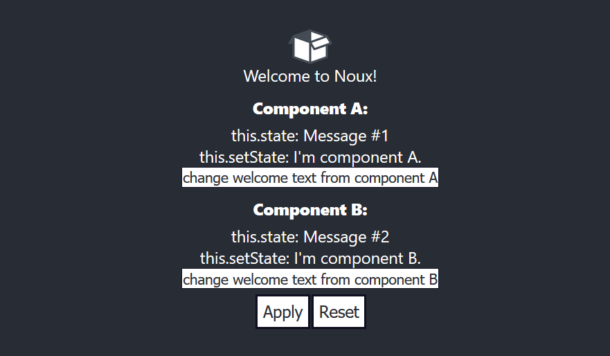

NOUX
-
#### Simple, Easy and Fast State Management for React.JS
##### You don't need to implement Reducers, Actions and other complex concepts for just only manage the states.

### Install
    npm i noux --save

### About
Noux is using Pub/Sub pattern with [PubSubJS](https://github.com/mroderick/PubSubJS) library. This is a experimental project. Please try the demo react app to understand this library. Please note that this is an experimental concept.

### Initialization
##### Import and declare "noux" into your main component.
```javascript
import noux from 'noux';

class Main extends Component {
    constructor() {
        super();
        this.noux = new noux({
            log: true // Optional [default: true]
        });
    }
}
```

### Passing noux
##### You have to pass noux into your components as props when you declare them.
```javascript
<SubComponent noux={this.noux}/>
```

### Passing noux to the sub components
##### You have to pass noux into your components as props when you declare them.
```javascript
class SubComponent extends Component {
    constructor(props) {
        super();
        this.noux = props.noux;
        this.noux.init({
            name: 'SubComponent',
            self: this
        });
    }
}
```

### Init
##### To initialize noux you have to call "noux.init" function. You can use this in any component.
```javascript
this.noux.init({
    name: '<current_component_name>',
    self: this
});
```

### State
##### By using "state" function you can get the value of specific state from the component.
```javascript
this.noux.state('<component_name>', '<state_name>')
```

### setState
##### By using "setState" function you can set the value of specific state from the component.
```javascript
this.noux.setState({
    target: "<component_name>",
    state: "<state_name>",
    value: "<state_value>"
});
```
Check the demo
---

###### Developed by [@rufatmammadli](https://twitter.com/rufatmammadli)